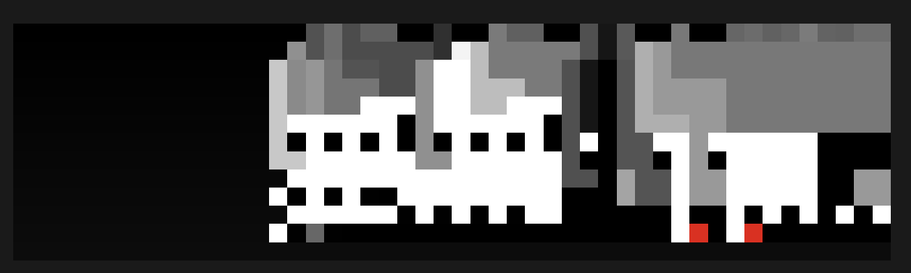

# jxl4fun

This challenge was inspired by the [crazy exploit of JBIG2 using XOR bitmap operators](https://googleprojectzero.blogspot.com/2021/12/a-deep-dive-into-nso-zero-click.html)

This challenge is a modified version of `libjxl` which is a modern JPEG format which includes a "predictor" tree (small virtual machine) to predict each pixel value

The modification adds new predictor opcodes which introduce vulnerabilities.

Overall the goal of this was to make players craft a image file which can calculate its own offsets given a uninitialized leak in the pixel buffer.

# Vulnerabilities

For more information on the vulnerabilities and the intended exploit, please see the `./solver`
